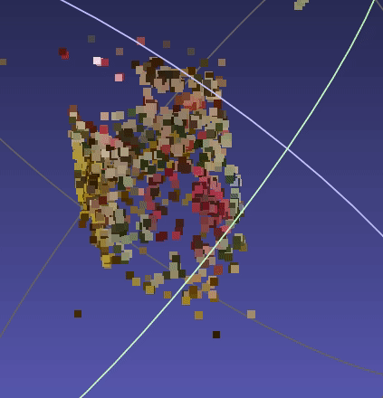
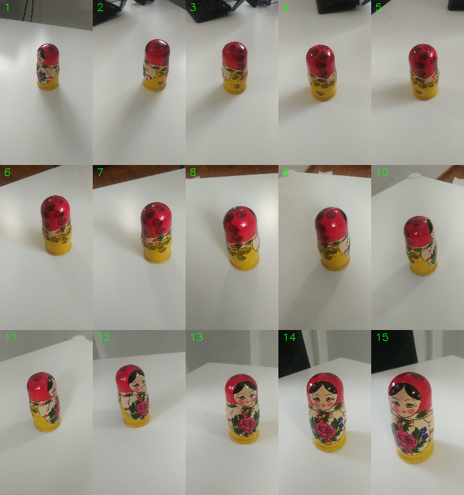
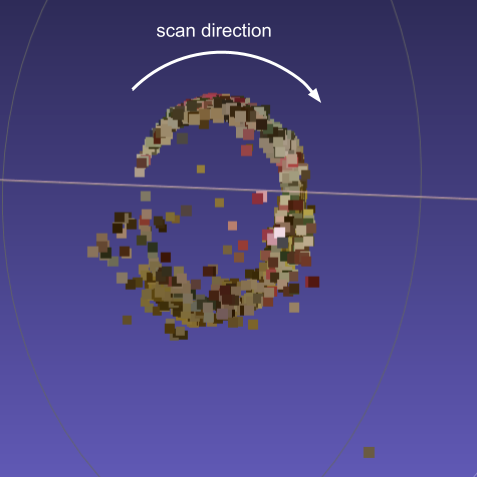
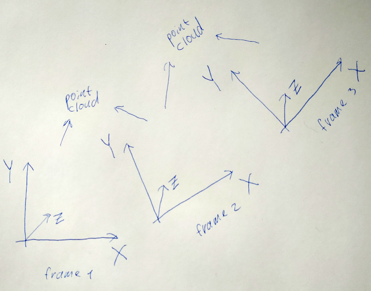

# Structure from motion  
####Result:  
  
You can see pink flower on the doll's belly and yellow back.  
Also you can see cylinder of the doll.  
Input images are in [doll_selected](./doll_selected) folder.  
Here is combined image:  
  
  
Bottom view:  
  
We can see that noise increases along scan direction.  
This is because this SfM is intremetal and errors are accumultated from frame to frame.  
Also we can see that doll cross section is not perfect circle.  
You can open 3d scan with Meshlab.
Data is in [pointCloud.ply](./pointCloud.ply) file.  
####How to use:
```sfm --video2frames path_to_video```  
   converts video to frames in png format  
   png will be stored in to a folder with name of the video file  
  
```sfm --calibrate path_to_images```  
   calibrate camera  
   path_to_images is directory with images  
   images are 6x9 chessboard images  
   images are png  
   then it prints calibration parameters  
  
```sfm --reconstruct path_to_images```  
   reconstruct 3d scene  
   path_to_images is directory with images  
   result will be saved to pointCloud.ply  
  
Images should have different enought point of view.  
Otherwise it would have low parralax and low accuracy.
    
####Description:  
Android Xiaomi redmi note 5 smartphone was used to get videos.  
First camera was calibrated with chess board images.  
Distortion was neglected. 
Found camera matrix:  
```text
[[1487.886270357746, 0, 547.1524898799552], 
[0, 1488.787677381604, 979.9460018614599],
[0, 0, 1]]
```
The algoritm works in the follow way:
1. Find SIFT keypoints on an image.
2. Compare descriptors of the keypoints with descriptors from previouse image. Get correspondance.  
3. Find essential matrix with findEssentialMat function.  
4. Find relative camera position and 3d point clound with recoverPose functon. Camera matrix is used.  
5. Find scale between current point cloud and previouse point cloud.
6. Scale current point cloud and relative camera shift.  
7. Calculate total relative camera position releated to first position.
8. Rotate and shift current point cloud to coordinate system of the first position of the camera.
  
As you can see there is no bundle adjustment here.  
5 point is inportant becuase relative camera pose shift and point cloud has ambiguity.      
It can be multiplied by any constant. Thus to define right constant point clouds are compared.  
Only points that are common for two point clounds can be used.  
To make 7 point the algorithm keeps current values for rotation matrix and shift from first camera position to current.  
To make point 8 inverted (transposed) matrix used.  

 


  
